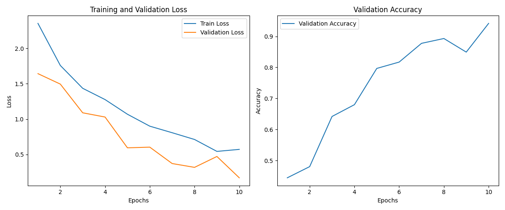

<a id="readme-top"></a>

<br />
<div align="center">
  <a href="https://github.com/yassa9/DLASU24_mission">
    
  </a>

  <h1 align="center" style="font-size: 60px;">DLASU24_mission</h1>

  <p align="center">
    Implementations & Experiments for DLASU24_mission.
    <br />

  </p>
</div>

<!-- ABOUT THE PROJECT -->
## About The Mission

The mission includes 3 problems where participants are tasked with solving advanced deep learning problems. The test includes:

  - `Finger Angle Prediction from EMG Data`: Participants will use a preprocessed dataset to build five models (Linear DNN, CNN, RNN, CNN-LSTM). The models must be trained for no more than 10 epochs.

  - `Data Representation`: Participants must write code to compress or represent the data in a low-dimensional format and visualize it.

  - `Oral Classification Paper`: Implementing specific methodologies from oral classification paper using InceptionResNetV2 or alternative approach.

For Full details, see that [PDF](https://github.com/yassa9/DLASU24_mission/blob/master/helpful_pdfs/DLASU24_mission.pdf)

<p align="right">(<a href="#readme-top">Back Top</a>)</p>

---

## Setup Used

- Nvidia GTX 1650
- Intel Core i5 10500H
- Arch Manjaroo Linux with i3WM
- Pytorch CUDA 12.4
- Dell G3 3500

---

## Problem I
#### Problem Statement:

Finger Angle Prediction from EMG Data

#### DNN Model:

- `Batch size` of 256 and epochs set to 10
- Simple `80/20` train-test split
- Mean Squared Error `MSE` used as the loss function
- `AdamW` optimizer with a learning rate of 0.001
- Fully connected DNN architecture with layer sizes of 256, 128, 64

```
    Device Used: cuda
    X_train_tensor is on cuda:0
    y_train_tensor is on cuda:0
    Data shape: torch.Size([4361620, 12])
    Labels shape: torch.Size([4361620, 14])
    Epoch [1/10], Loss: 327.8025
    Test Loss: 317.1231
    Epoch [2/10], Loss: 317.5175
    Test Loss: 317.6609
    Epoch [3/10], Loss: 317.4942
    Test Loss: 317.8176
    Epoch [4/10], Loss: 317.4882
    Test Loss: 317.0061
    Epoch [5/10], Loss: 317.4864
    Test Loss: 317.0689
    Epoch [6/10], Loss: 317.4660
    Test Loss: 317.7463
    Epoch [7/10], Loss: 317.4550
    Test Loss: 318.1818
    Epoch [8/10], Loss: 317.4570
    Test Loss: 317.0602
    Epoch [9/10], Loss: 317.4376
    Test Loss: 317.9086
    Epoch [10/10], Loss: 317.4153
    Test Loss: 318.8539
    Model saved: DNN_model.pth
    Total time taken: 00:07:58

```

#### CNN tabular:

- `Batch size` of 256 and epochs set to 10
- Simple `80/20` train-test split
- Mean Squared Error `MSE` used as the loss function
- `AdamW` optimizer with a learning rate of 0.001 and weight decay (L2 regularization) of 1e-4
- CNN architecture with 1D convolutions, batch normalization, global average pooling, and dropout
- `LeakyReLU` activation function with a negative slope of 0.01


#### CNN sequential:


#### RNN model:

- `Batch size` of 4 and epochs set to 10
- Simple `80/20` train-test split
- Mean Squared Error `MSE` used as the loss function
- `AdamW` optimizer with a learning rate of 0.001
- RNN architecture with LSTM layers, hidden size of 128, and 2 layers
- Sequential EMG data is padded to match sequence lengths


#### CNN-LSTM:

- `Batch size` of 4 and epochs set to 10
- Simple `80/20` train-test split
- Mean Squared Error `MSE` used as the loss function
- `AdamW` optimizer with a learning rate of 0.001
- CNN-LSTM architecture with two 1D convolutional layers followed by LSTM layers
- Hidden size of 128 and 2 LSTM layers
- Input data assumed to be 3D (batch_size, sequence_length, features)


<p align="right">(<a href="#readme-top">Back Top</a>)</p>

---

## Problem II

#### Problem Statement:

For the same problem above with the same data used how we can represent the data ? \
write a code that compress the data or represent the data with low dimensional representation and plot it.

In `EMG` directory, there is a sub-dir called `representational_learning` containing 2 other sub-dirs. \
One is `models` and the other is `plots`, you can easily conclude what they're for ...

#### My Solution Choice:

- Used `PCA` & `t-SNE` approaches.
- I wasn't comfortable at first applying them by `CPU` not `GPU`, tried to implement t-SNE on my own by `pyTorch` by sending tensors to `CUDA`, and it asked for 70TB of memory !!
- I implemented t-SNE using just `10 ~ 20k samples` as it is computationaly expensive.
- I found another approach called `UMAP` but I was satisfied by PCA and t-SNE results.

#### Assumptions Taken:

  - The number of components for PCA is set to 3, assuming that the original data's dimensionality can be effectively reduced to 3 without losing significant information.
  - PCA is used to reduce the dimensionality of the data for visualization purposes. It assumes that the first three principal components capture a significant portion of the variance.
  - For t-SNE: using a random subset of the data (20,000 samples) as it's super computational expensive to include whole dataset.
  - The number of components for t-SNE is set to 2.

<div align="center">
  <a href="https://github.com/yassa9/DLASU24_mission">
    
  </a>
  <p align="center">
    t-SNE 2D visualization
    <br />
  </p>
</div>

#### Bottlenecks Found:

  - Reducing the data to only 3 components via PCA gonna lead to information loss.
  - PCA is a linear technique, which assumes that the variance in the data is best captured by linear combinations of the original features.
  - Depending on the size of the datasets, loading `X_train_tabular.npy` and `y_train_tabular.npy` files into memory might be a bottleneck.
  - t-SNE is computationally expensive, especially as the dataset size increases. Even with a subset of 20,000 samples, t-SNE can take a significant amount of time to run. The time complexity of t-SNE is `O(N^2)`, which can be a bottleneck for larger datasets.
  - Reducing the data to only 2 dimensions with t-SNE may oversimplify complex patterns. Although t-SNE captures non-linear relationships well, reducing to just 2 components might not always reveal the full structure of the data.
  - The choice of perplexity (set to 30) can significantly affect the results. Perplexity controls the effective number of neighbors used in the analysis, and inappropriate values can lead to suboptimal clustering. Fine-tuning this parameter requires experimentation, which is computationally expensive.

---

## Problem III

#### Problem Statement:

- You will need to review this [paper](https://github.com/yassa9/DLASU24_mission/blob/master/helpful_pdfs/oral_paper.pdf) and attempt to implement the described methodology to achieve the same results. The data required can be found [here](https://drive.google.com/drive/u/0/folders/1k24VOveceyqqYS4oaBR0iWLiDpsDEUk6).

#### My Solution Choice:

- In `DL_oral_paper` directory, there is `oral_classification.py` for implementing `InceptionResNetV2` method.
- There is also `oral_resnet18.py` which is my choice of implementation, using model of `ResNet18` which is light and highly used by practitioners.

#### Assumptions Taken:

- Pretrained Inception V3 weights provide a good starting point for transfer learning.
- Used 10 Epochs to train `InceptionResNetV2` model but 20 Epochs for `ResNet18` one.
- Early stopping with patience=3 is sufficient to prevent overfitting.
- Resize to (299, 299): Standardizes input size for the Inception model.
- Random Rotation: Rotates the image randomly by up to 25 degrees.
- Random Horizontal Flip: Flips the image horizontally with a probability of 50%.
- Random Resized Crop: Randomly resizes and crops the image within a scale of 0.8 to 1.0.
- Color Jitter: Randomly adjusts brightness within a range of 0.5 to 1.0.
- Random Affine Transformations:
  - Shear: Applies up to 20 degrees of shear.
  - Translation: Shifts the image up to 10% horizontally and vertically.
  - Zoom: Scales the image randomly between 0.9 and 1.1.
- Data normalization using the calculated mean and std by GPU not `imageNet` default mean and std.

#### Comparisons:

  ```
  - Current Device Used: cuda
  - Calculated Mean: tensor([0.7326, 0.5028, 0.4792], device='cuda:0')
  - Calculated Std: tensor([0.1802, 0.2034, 0.1972], device='cuda:0')
  Epoch [1/10], Loss: 2.3557
  Validation Loss: 1.6437, Accuracy: 0.4446
  Epoch [2/10], Loss: 1.7596
  Validation Loss: 1.4956, Accuracy: 0.4805
  Epoch [3/10], Loss: 1.4361
  Validation Loss: 1.0890, Accuracy: 0.6420
  Epoch [4/10], Loss: 1.2763
  Validation Loss: 1.0288, Accuracy: 0.6800
  Epoch [5/10], Loss: 1.0686
  Validation Loss: 0.5928, Accuracy: 0.7967
  Epoch [6/10], Loss: 0.8994
  Validation Loss: 0.6022, Accuracy: 0.8171
  Epoch [7/10], Loss: 0.8066
  Validation Loss: 0.3699, Accuracy: 0.8774
  Epoch [8/10], Loss: 0.7110
  Validation Loss: 0.3158, Accuracy: 0.8930
  Epoch [9/10], Loss: 0.5420
  Validation Loss: 0.4702, Accuracy: 0.8492
  Epoch [10/10], Loss: 0.5706
  Validation Loss: 0.1679, Accuracy: 0.9416
  Training complete
  Test Loss: 0.1852, Accuracy: 0.9358
  Plot saved to training_validation_loss_accuracy.png
  Model saved to oral_inception_model.pth
  - Duration: 00:31:32
```
- That was output of my script for `InceptionResNetV2` implementation.
- We can observe that after only 10 epochs, accuracy is near `93.58 %` which is good comparable to that `~99%` of the original paper.
- I believe that higher epochs gonna converge to the same accuracy at last.

<div align="center">
  <a href="https://github.com/yassa9/DLASU24_mission">
    
  </a>
  <p align="center">
    Training validation loss and accuracy for inception model
    <br />
  </p>
</div>

---

```
Validation Loss: 0.5432, Accuracy: 0.8366
- Duration of Epoch: 00:01:08
Epoch [10/20], Loss: 0.3642
Validation Loss: 0.5554, Accuracy: 0.8395
Early stopping triggered!
Training complete
Test Loss: 0.4475, Accuracy: 0.8628
Plot saved to training_validation_loss_acc_resnet.png
Model saved to resnet18_model.pth
- Duration: 00:13:39
```

- That is output last part (trimmed) out of `ResNet18` model.
<div align="center">
  <a href="https://github.com/yassa9/DLASU24_mission">
    
  </a>
  <p align="center">
    Training validation loss and accuracy for resnet18 model
    <br />
  </p>
</div>
